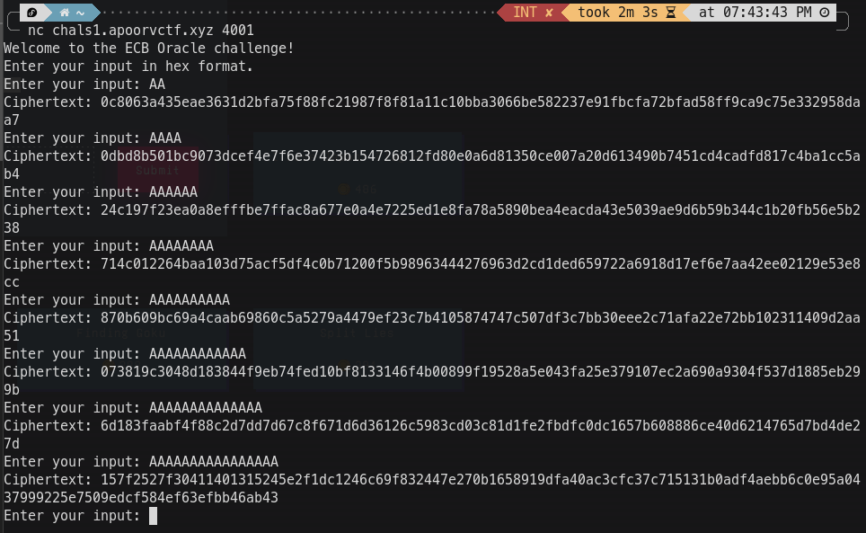

## Kowareta Cipher [Cryptography]

**Author:** _orangcar_

## Challenge Description

In Tokyo’s cyber arena, Kowareta Cipher has left secrets exposed. Coding prodigy Lain Iwakura encrypted her messages with AES—but without an IV, patterns emerge, revealing cracks in her defenses. Can you break the cipher and uncover the truth? 🔐💻

## Solution

This is a classic AES-ECB question. The user input and flag are concatenated and encrypted with AES-ECB mode by generating a random 16-byte flag. To solve this question, we should understand how AES-ECB works and why it is insecure and not recommended. A small description about AES-ECB is:

AES-ECB mode encrypts data by breaking it into 16-byte blocks and encrypting each block separately with the same key. This creates a major security flaw: identical input blocks produce identical output blocks, revealing patterns in the encrypted data. Without an initialization vector, the encryption lacks randomness. In the Kowareta Cipher challenge, attackers can exploit this by carefully crafting inputs that are concatenated with the hidden flag before encryption. By controlling the input length to align blocks properly, they can recover the flag one byte at a time by looking for matching encrypted blocks. This technique works like a guessing game, revealing the flag character by character and demonstrating why ECB mode is considered insecure for real applications.

### For each user input:

1. User provides input in hex format.
2. Server constructs: user input + flag + user input.
3. This is padded to a multiple of 16 bytes.
4. The padded data is encrypted with AES-ECB.
5. The ciphertext is returned to the user.

### Finding Flag Length:

We need to find the length of input at which our output length changes.

  

For input sizes 1 to 7, we're getting 3 blocks of ciphertext:
- `0c8063a435eae3631d2bfa75f88fc219` [1 byte input + 15 bytes flag]
- `87f8f81a11c10bba3066be582237e91f` [16 byte flag]
- `bcfa72bfad58ff9ca9c75e332958daa7` [1 byte flag + 1 byte input + 14 byte padding]

You can try and see that we'll get 3 blocks output until 7 bytes input size.

But when we give an input of 8 bytes, our output changes to 4 blocks:
- `157f2527f30411401315245e2f1dc124` [8 byte input + 8 bytes flag]
- `6c69f832447e270b1658919dfa40ac3c` [16 byte flag]
- `fc37c715131b0adf4aebb6c0e95a0437` [8 byte flag + 8 byte input]
- `999225e7509edcf584ef63efbb46ab43` [16 bytes extra padding]

Thus, we can confirm our flag size is 32 bytes.

### Byte-by-Byte Recovery:

We know that the initial flag is "apoorvctf" (9 bytes are known).
`known_flag_hex = "61706f6f7276637466"`

1. We want to recover the 10th character of the flag:
   - Send an input of 6 bytes (e.g., "AA" \* 6).
   - User input + Flag + User input will be:
     `AAAAAAAAAAAAapoorvctf{` --> 1st block
     `16 bytes flag` --> 2nd block
     `last 6 bytes of flag + AAAAAAAAAAAA + 4 bytes padding` --> 3rd block

Then we'll craft our input [AAAAAAAAAAAAapoorvctf|X], where 'X' is the 10th byte of the flag.

    For each possible byte 'X' (i.e., 0 to 256):
    - Send an input ("AAAAAAAAAAAAapoorvctf" + "X").
    - 1st block: [AAAAAAAAAAAAapoorvctfX]
    - 2nd block: [16 bytes of flag]
    - 3rd block: [16 bytes of flag]
    - 4th block: [AAAAAAAAAAAAapoorvctfX]

If the 1st block ciphertext of the previous input and current input matches, then the 10th character of the flag is found.
- `2c710b3c4808cfd352f3003668115d30` --> `AAAAAAAAAAAAapoorvctf{`
- `f7325c97f17d163bffb0a513cc46a353` --> `16 bytes flag` --> 2nd block
- `0a61ad1e7741319db2a470fb52d667ef` --> `16 bytes flag` --> 3rd block
- `58bd304cf69114f3ab3a76f8be56bf8d` --> `AAAAAAAAAAAAapoorvctf{`

The 1st block is the same, which confirms the 10th byte is `7b` (i.e., '{').

Similarly, we can leak all bytes of the flag. Let's write a script to automate our task.

### Exploit code is added in /Files

To solve this challenge (after 5th March) via `nc`, run `server.py` in one terminal and run `Exploit.py` in another terminal.
