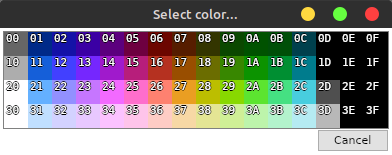
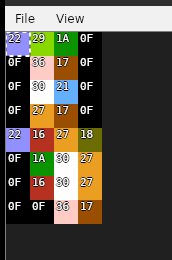
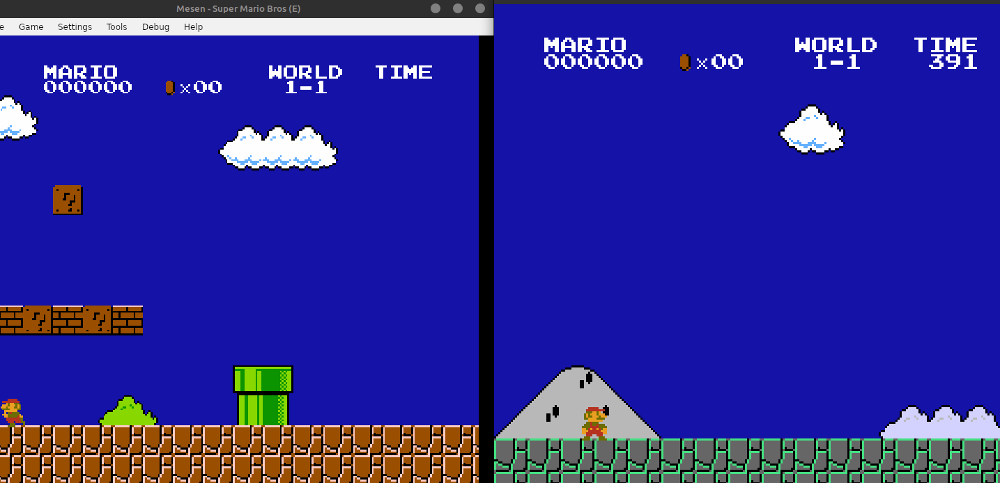

## Description

### **The Cursed Console - 呪われたカセット**

Long ago, in the age of 8-bit warriors, there existed a legendary game cartridge said to grant ultimate gaming prowess. However, a great curse befell it, causing glitches, distortions, and bizarre anomalies. Some say the spirit of a forgotten developer haunts the code, whispering secrets through corrupted pixels.

A mysterious ROM (ok its just super mario) has surfaced, along with a modified NES emulator to run it. The game is playable, but something is deeply wrong.

Will you be able to uncover the hidden flag within the glitched world?


- **Author:** Afdul
- **Flag:** `apoorvctf{Br}OOk}`

---

## Setup Instructions

For manual setup:
- An NES emulator (bundled) is required.
- Run the provided ROM file using the emulator.
```bash
    Sfml is needed to run the emulator.
    sudo apt install -y libsfml-dev
    ./emu <rom_file>
```

---

## Hardware / Misc
  
- Prior knowledge of NES memory layout, debugging ROMs, and reverse engineering may be helpful.
---

## Writeup

The challenge revolves around analyzing the broken NES ROM and the emulator to identify unintended behaviors. 

There are rendering issues in any NES game you run with the provided emulator, meaning the issue lies in the emulator itself. Flickering indicates the PPU is malfunctioning, but the true flag is hidden in the colors being added to the palette. 
The PPU stores 32 bytes of palette data in VRAM.The palette is split into background and sprite palettes, each using 4 sets of 4 colors.
The flag is hidden in the background palette colors.


Load up your favorite game in Mesen, such as Super Mario Bros. Open the palette viewer and compare the background color values to those given in the challenge. The colors correspond to ASCII values of the flag, mod 64, to handle overflow.


This is the Value of 64-bit colors in any standard NES game.


This is the colors of the background palette in the default NES game.


Keep changing all colors to match the modded emulator colors.
Now just change the colors based on the values in the modded emulator and you will get the flag.

Eg : 
```
First bg pallete corresponds to dark blue which is 0x02.
    0x02 + 64 = 66 -> ASCII value of B
    ... and so on
```


---

**File Structure:**
- `files/` - Contains the NES ROM and emulator for participants

