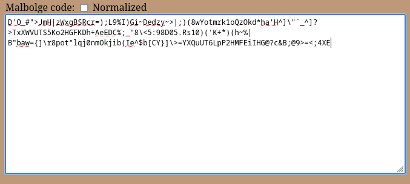
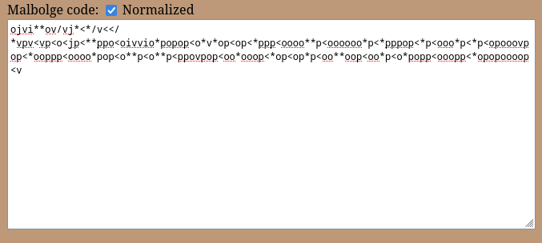
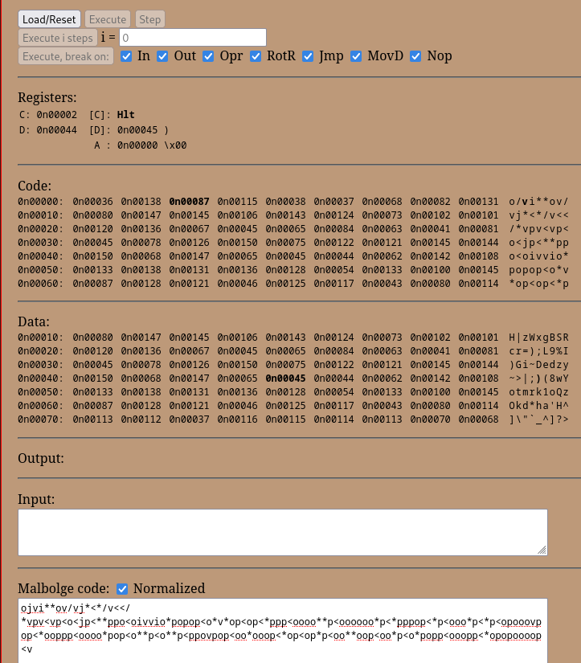
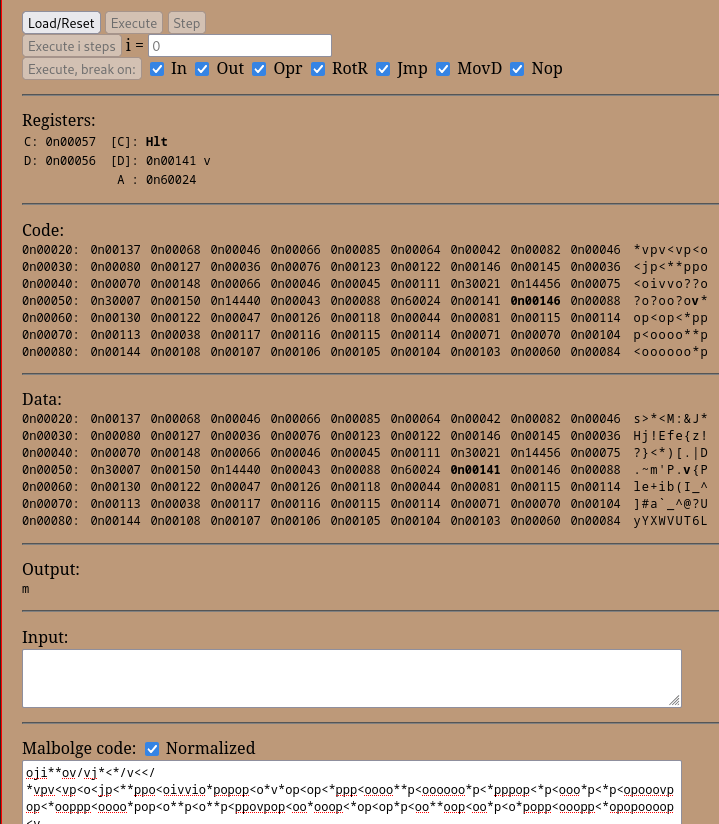
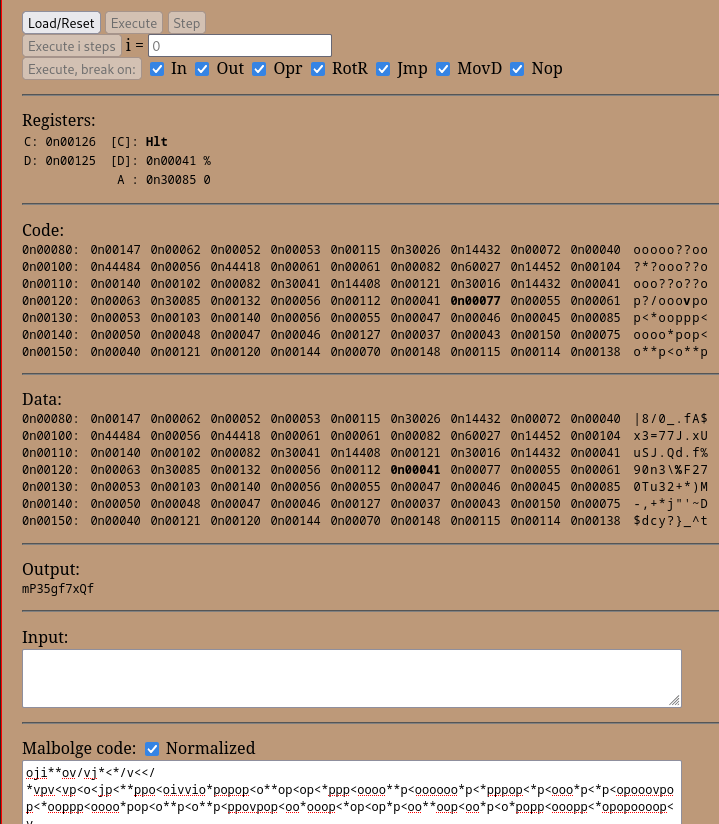
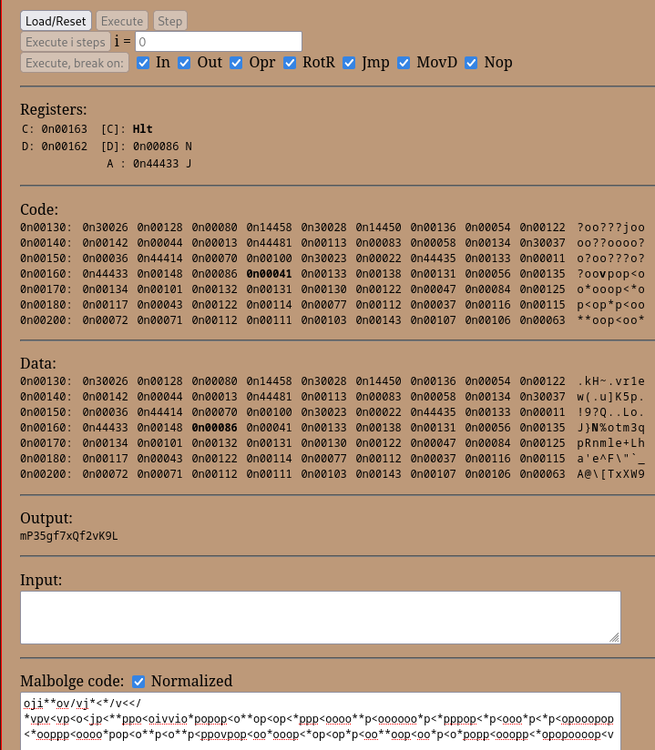
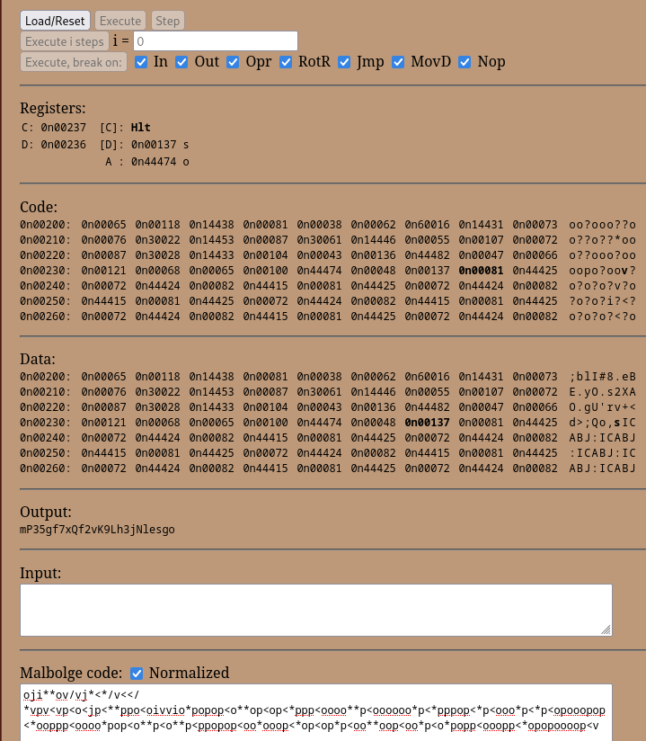
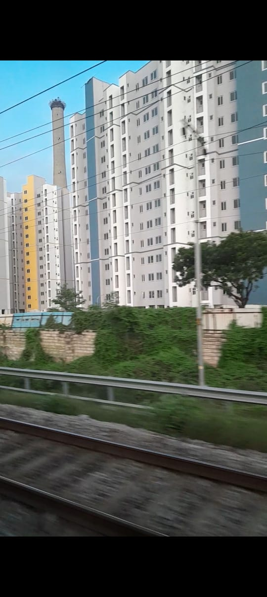
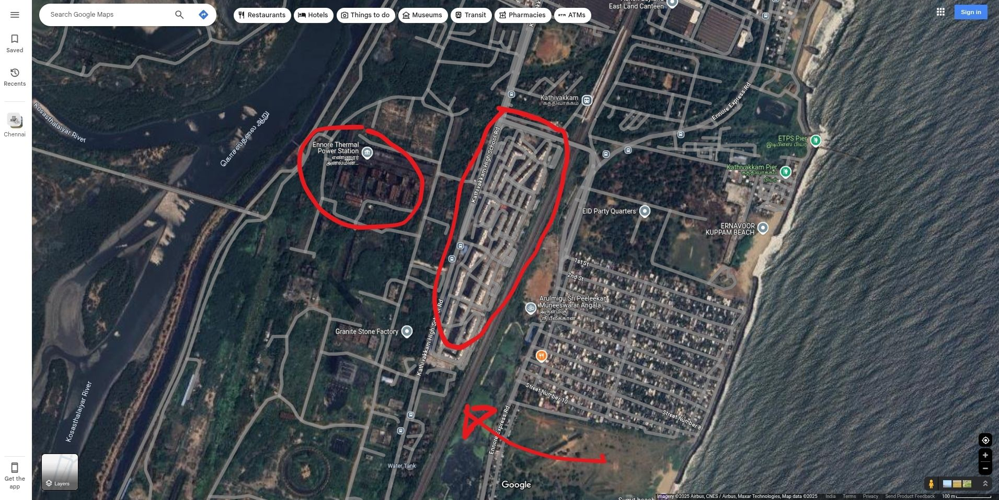

## Lost in Encryption 🔐 [Miscellaneous]

**Author:** _orangcar_, _NotAProton_

## Challenge Description
While traveling on the 22647 train, nearing Chennai, I captured an image of a place with an intriguing tower-like structure. Just as I was about to admire it, my ever-annoying brother decided to play a cruel joke—he encrypted the image using **AES-ECB** and, to make things worse, turned the key into an incomprehensible mess of symbols:

```text
D'O_#">JmH|zWxgBSRcr=);L9%I)Gi~Dedzy~>|;)(8wYotmrk1oQzOkd*ha'H^]\"`_^]?>TxXWVUTS5Ko2HGFKDh+AeEDC%;_"8\<5:98D05.Rs10)('K+*)(h~%|B"baw={]\r8pot"lqj0nmOkjib(Ie^$b[CY}]\>=YXQuUT6LpP2HMFEiIHG@?c&B;@9>=<;4XE
```

Yeah… utter gibberish. Now, I'm left with an encrypted image and a scrambled key that makes no sense.

Do you have what it takes to untangle this mess and find the name of the place where tower resides? 🕵️‍♂️

**Example:**  
Brigade Gardens  
Flag: `apoorvctf{brigade_gardens}`

## Solution

Our task starts with identifying the encrypted key. The hint suggests it's an esoteric programming language. After research, we discover it's **Malbolge** - one of the most disliked and challenging languages among programmers.

Learn more about Malbolge here: [Malbolge Documentation](https://esolangs.org/wiki/Malbolge)

To execute this code, we need a compiler/interpreter. While online compilers exist, the code doesn't run directly due to halts (breakpoints). After reading the documentation, we learn that 'v' acts as an endpoint. We need to remove these v's that halt the code.

I used this [Malbolge debugger](https://lutter.cc/malbolge/debugger.html) for debugging.

<p align="center">
  
</p>

<p align="center">
  
  <br><em>Normalized code for easier debugging</em>
</p>

### Debugging Process
Remove v's that halt the code execution:
> Note: First load the code, then click execute for complete execution or click step to execute step by step

<p align="center">
  
  <br><em>Initial debug state</em>
</p>

<p align="center">
  
  <br><br>
  
  <br>
  <br><em>Removing highlighted v's step by step</em>
</p>

After execution, we obtained the **ECB key**: `mP35gf7xQf2vK9Lh3jNlesgo`

### Decryption Script
```python
from Crypto.Cipher import AES

key = b"mP35gf7xQf2vK9Lh3jNlesgo"

def decrypt_image(input_file, output_file, key):
    with open(input_file, "rb") as f:
        encrypted_data = f.read()

    cipher = AES.new(key, AES.MODE_ECB)
    decrypted_data = cipher.decrypt(encrypted_data)

    with open(output_file, "wb") as f:
        f.write(decrypted_data)

    print(f"Decryption complete. Decrypted image saved as {output_file}")
    
decrypt_image("chall.jpg", "decrypted.jpg", key)
```

### Result Analysis
After running the script, we get our decrypted image:

<p align="center">
  
  <br><em>Decrypted image showing a tower behind apartments</em>
</p>

Given that the photo was taken from train 22647 nearing Chennai, we tracked the train's route and found the location:

<p align="center">
  
  <br><em>The arrow shows the train track, and the apartment matches the decrypted image</em>
</p>

The tower-like structure is identified as the **Ennore Thermal Power Plant** behind the apartment.

### Flag
🚩 `apoorvctf{ennore_thermal_power_plant}`
