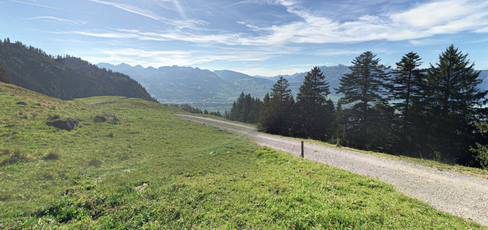
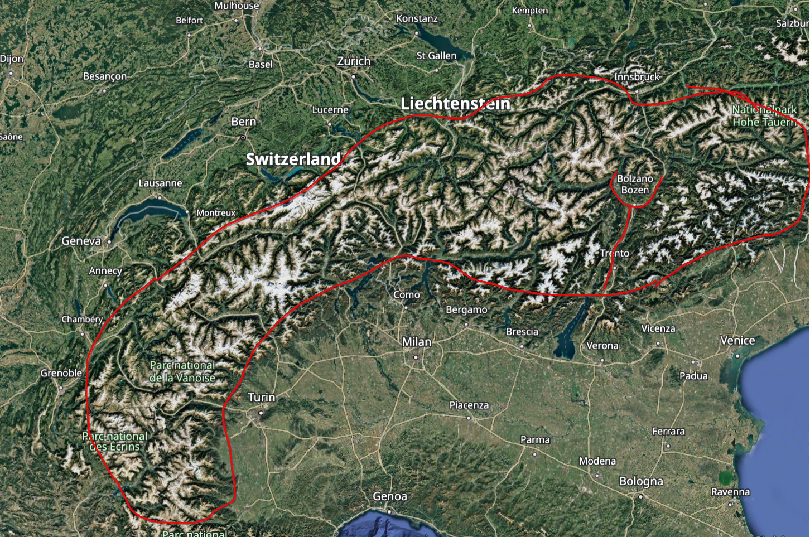
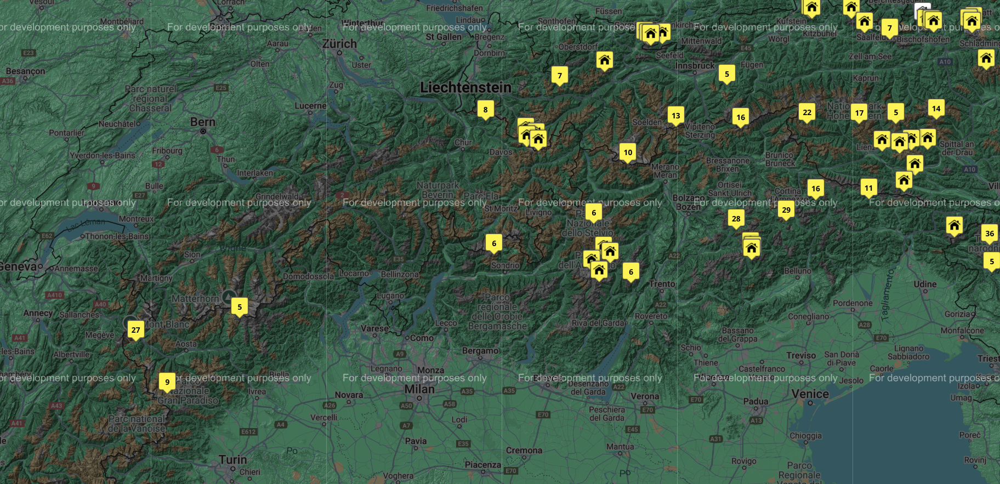
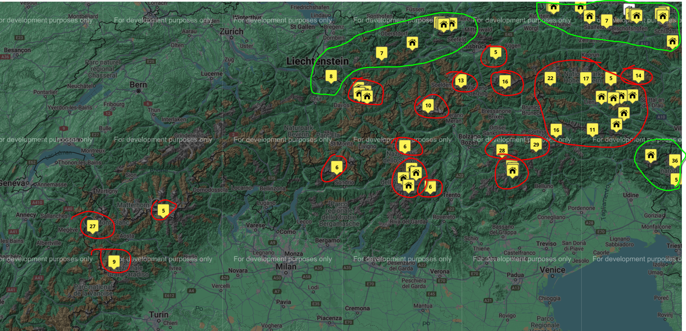
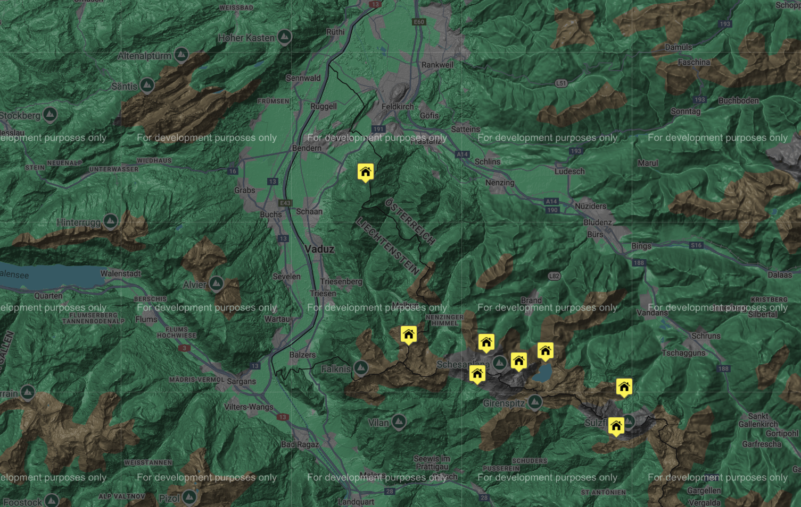
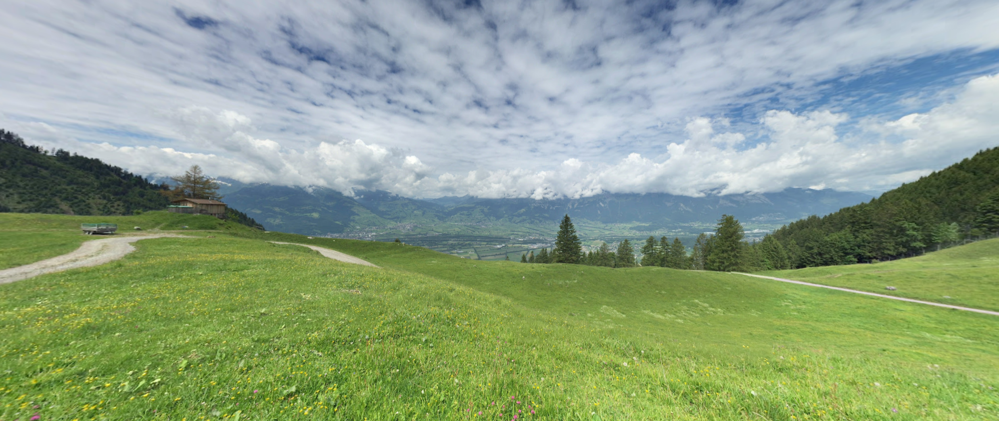

# 404: Location not found

## Description
My friend Daniel S loved traveling. He used to send me pictures of his trips across Europe. Here's one from his favourite trail. I want to visit the place in his memory, help me find it.
flag_format: apoorvctf{<coordinates>}
coordinates should be truncated to the 4th decimal position

Example:
Eiffel Tower
Coordinates: 48.8583951,2.2949823
Flag: apoorvctf{48.8583,2.2949}

> Author: `Cooker`

Hint: `It's around Switzerland and Austria :)` It actually was :\)

Flag: `apoorvctf{47.1851,9.5663}`

## Writeup

- Open the image file using any 360 image viewer.

 

- Taking a small snapshot and uploading to google lens shows a lot of suggestions and similar photos from the alps (specifically the swiss alps). This is evident from the kind pine trees and the european looking hut at the top. Looking at the image, the mountains look less dense and there is a flat area indicating it is not deep in the alps(probably somewhere along the edges). The size of the mountains and the trees rule out the possibility of it being any other mountain range in europe.

 

- Looking at the height and flat area, we can narrow down our search for the location to these areas around the red line.

- The path looks like a public trail, proving that the hut at the top must be some trail hut.

 

- With this information, we look at the mountain huts in the alps from the website [mountainhuts.info/map](http://www.mountainhuts.info/map). Since we have limited our search to the red line, we can start exploring mountain huts. Trails in alps usually have huts for the hikers to take shelter.

 

- After analysing the topology, we can safely conclude that the huts in red are located in dense, large mountains which do not match with the picture. The ones in green are probable locations.

 

- We look through the huts and find that the one in Liechtenstein resembles the image a lot.

 

- This image from near the hut is pretty close to the actual image. It has open space and the trees and the mountain in teh back is also very similar.

- We walk a few images down the trail and find the exact image uploaded by `Daniel S`. The coordinates of which are `47.18517981,9.56631563`.
[link to image](https://earth.google.com/web/@47.18517981,9.56631563,1372.25413314a,0d,90y,236.66286176h,89.9329669t,0r/data=CgRCAggBIjAKLEFGMVFpcE00Sml3NV8zMXNBYnVSOUJuREh2MEtLSHkxaUIxaV9wQ05UVHpmEAU6AwoBMEICCABKDQj___________8BEAA).

Note: We can also look at the trail databse but it would be too large and would take a lot of time to scan through.