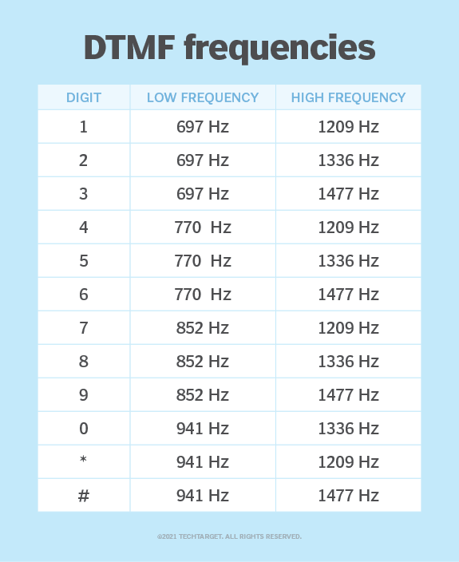

## Descroption
Bro who is this buffedpetah88 they keep yapping abt. 

- Author: hampter
- flag: APOORVCTF{PETAH_THE_HOSRSE_IS_HEA_BTW} or apoorvctf{petah_the_hosrse_is_hea_btw}
- Category: OSINT/Misc

## Writeup

We have been given a png file. First thing i do when i get anything like this is run `strings` or `exiftool` or just basic stuff.

Running `exiftool petah.png` we get
```
exiftool petah.png
ExifTool Version Number         : 13.19
File Name                       : petah.png
Directory                       : .
File Size                       : 261 kB
File Modification Date/Time     : 2025:03:01 22:19:58+05:30
File Access Date/Time           : 2025:03:01 22:20:04+05:30
File Inode Change Date/Time     : 2025:03:01 22:19:58+05:30
File Permissions                : -rw-r--r--
File Type                       : PNG
File Type Extension             : png
MIME Type                       : image/png
Image Width                     : 700
Image Height                    : 830
Bit Depth                       : 8
Color Type                      : RGB with Alpha
Compression                     : Deflate/Inflate
Filter                          : Adaptive
Interlace                       : Noninterlaced
Comment                         : username:buffedpetah
Image Size                      : 700x830
Megapixels                      : 0.581
```

Notice the `Comment : username:buffedpetah`

So i looked online for some guy named petah, just tried different social media accounts.

Found him on github.


His README.md seems to be in japanese, so i tried to translate it 
```
🐔 Buffed Peta 🐔

Hello, my name is Peter Griffin. I'm a student by day and a Fortnite warrior by night. Taste a hamburger that may be a portal to another dimension, and enjoy the strange moments of being at the mercy of life. One time I saw my horse attempt a moonwalk under a double rainbow. I calmly surrender to the cosmic absurdities of everyday life.

If you search my files, you might come across something interesting.

I'm an idiot, but I'm also a genius.
```

Nothing usefull

Next i started looking through his repos, there was only one `freakQuest`

There were only two files, `analyze.py` and `project.obj`

looking at `project.obj` 
```
v 941 1209 8200
v 941 1209 9900
v 852 1477 10900
v 697 1477 5200
v 941 1477 11100
v 770 1209 4200
v 697 1336 10400
v 941 1209 6300
v 852 1336 1800
v 941 1209 2000
v 852 1336 10700
v 941 1209 1600
v 697 1477 9700
v 852 1209 8900
v 941 1209 4400
v 770 1209 4300
v 770 1477 1000
v 770 1209 5000
v 941 1209 5400
v 770 1209 5700
v 852 1209 1500
v 852 1209 300
...
```


these are just vertices no mesh, so opening in a 3d viewer wouldnt help, so i started searching online on what these values could be, then i found first two values represent the low-high frequescies of dtmf tones

but we still need to figure out what he 3rd value is, looking at the patter the 3rd values are like 100, 200, 300, 400, ...

so i figured they are time, So sorted these values based on the 3rd value use dtmf table for the 1st and 2nd values and got this

```
2*7*666*666*777*888*222*8*333*#*7*33*8*2*44*#*8*44*33*#*44*666*7777*777*7777*33*#*444*7777*#*44*33*2*#*22*8*9*#
```

These lookes like those old dialpad way of typing,


substituting with this and using * as delimers we get

```
APOORVCTF#PETAH#THE#HOSRSE#IS#HEA#BTW
```

substituting # we get
```
APOORVCTF{PETAH_THE_HOSRSE_IS_HEA_BTW}
```