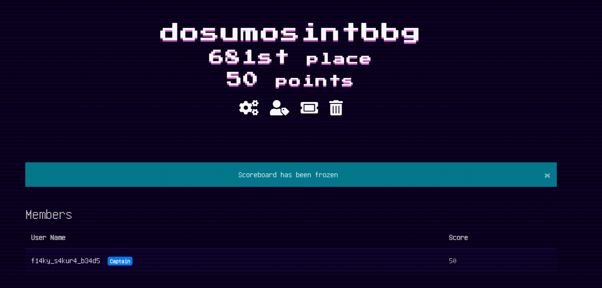
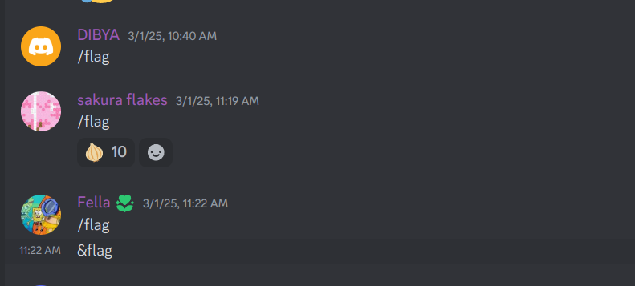
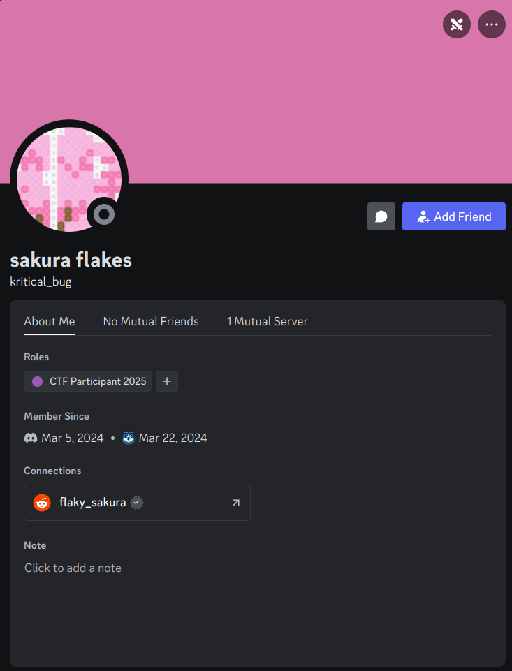
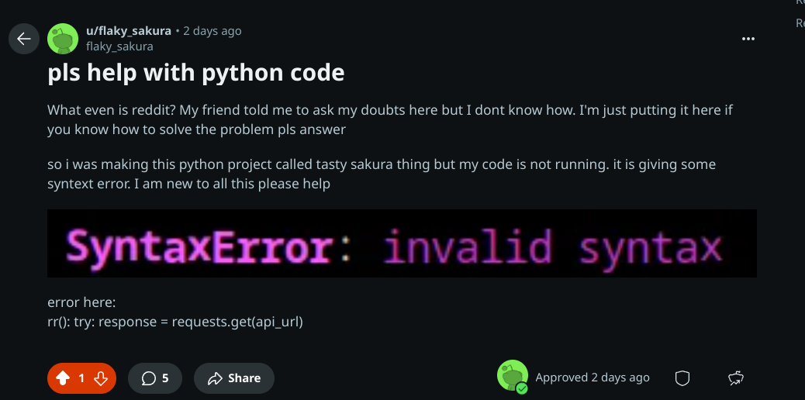
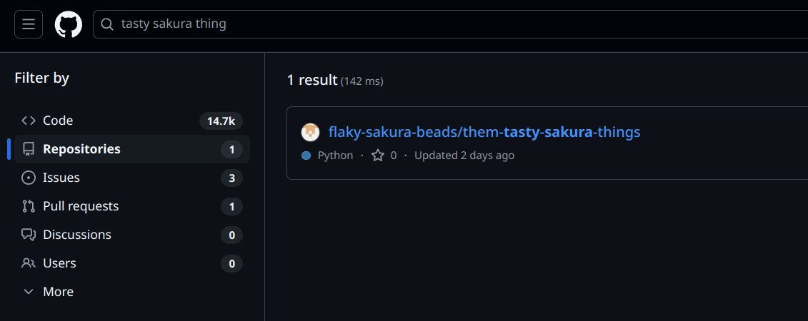
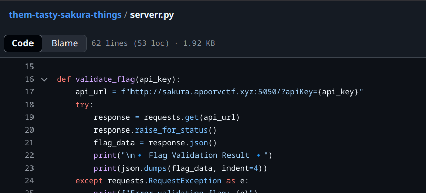
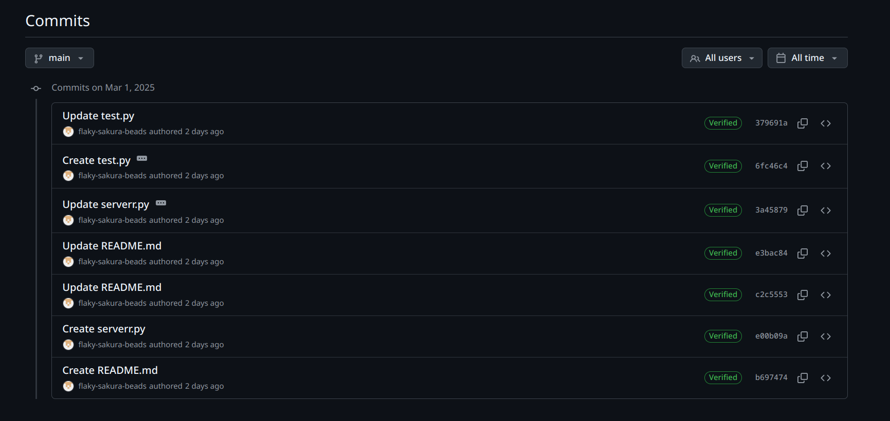
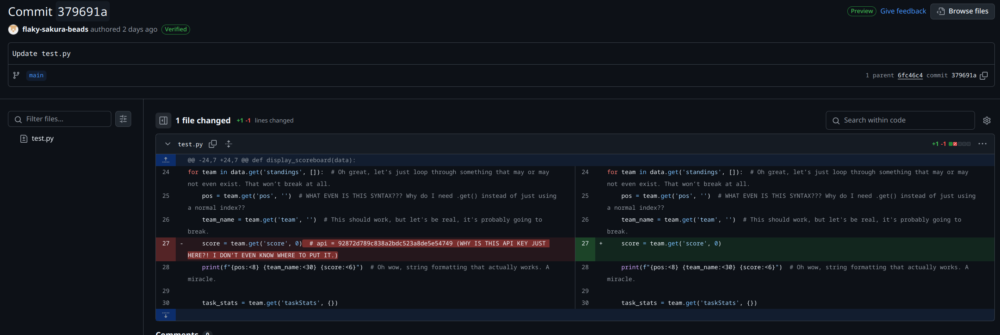

# Sakura Flakes

## Description:
Hey everyone, I have a friend Sakura. She wanted to learn how programming works so I gave her the best advice anyone could have given her- participate in ApoorvCTF.
She's trying her best to find flags and could only find the welcome flag, sending /flag XD.
If you consider yourself real OSINTers — stalk her.

> Author: `Cooker`

_Note: All characters in this challenge are completely imaginary._

Flag: `apoorvctf{hello_everynian_2w345sm}`
 
## Writeup:

- Sakura was a part of the CTF, having solved the welcome challenge

 

- In the discord server, Sakura sent `/flag` like many other participants.

 

- When we open the profile of `kritical_bug` aka `sakura flakes`, we can see there is a reddit linked to the account.

 

- The reddit account has some posts regarding help with the python code. This is also a throwback to the challenge description where she wants to learn programming. All the other posts are completely unrelated and AI generated.
We also notice that the post mentions that she is trying to make a project named `tasty sakura thing`.

 

- People usually upload their projects on GitHub. We open GitHub and search up the term `tasty sakura thing` and the only result that pops up is the a project by `flaky-sakura-beads`.

 

- We open the `serverr.py` and find that there is a URL to something with `apiKey` parameters.

 

- On checking the commits, we see that there have been many updates to both the files.

 

- The latest commit has a comment deleted which had the required `apiKey`. Sakura probably forgot to remove it from the code. Remember, she's new to programming.

 

- We use the `apiKey` and `URL` to find the flag on the website.
