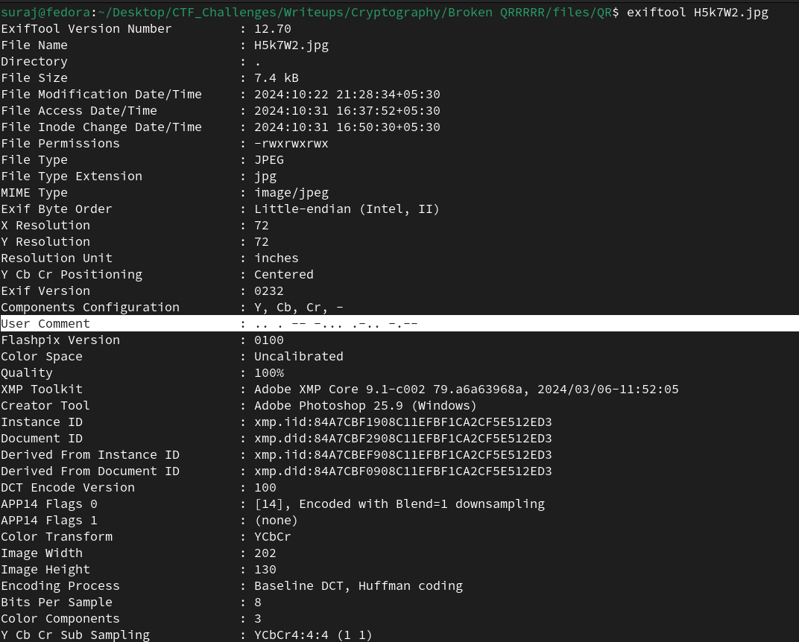
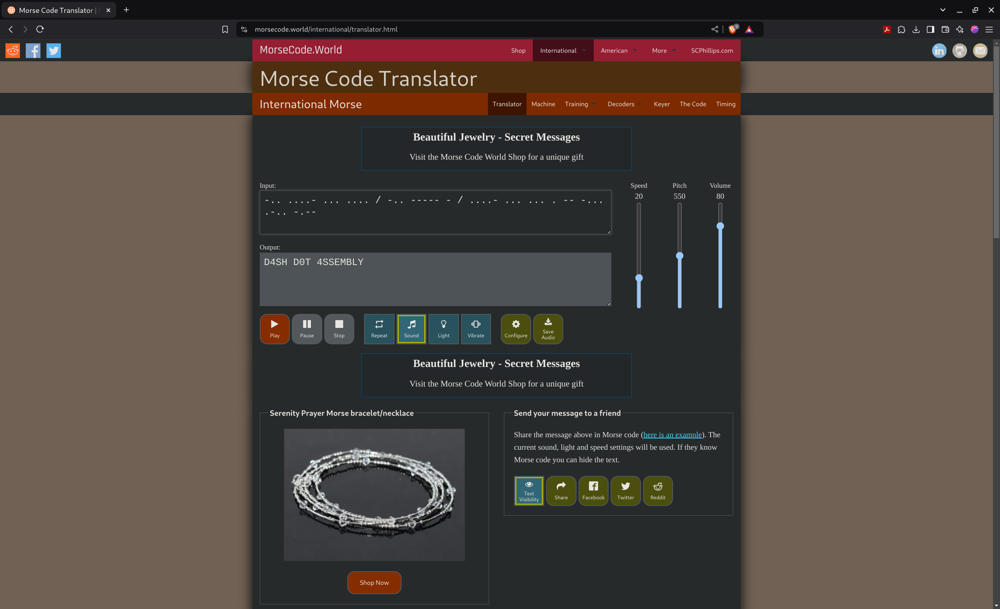

# Broken QRRRRR

**Author: Suraj S**  
**Points: 100**  
**Difficulty: Easy**  

**Description:**  

The auditor discovers QR code fragments embedded in presentation slides used during meetings. Try piecing them together to uncover any hidden secrets within the company.

#### [QR.zip](QR.zip)

## Solution

    
The challenge presents four pieces of an RMQR code. Initially, when we scan the RMQR, we receive a fake flag.


We can check for any metadata for these images. To extract this information, we can use **ExifTool**, a powerful command-line utility for reading, writing, and editing metadata in various file formats, including images.
   
To inspect an image, the command is as follows:

```bash
exiftool H5k7W2.jpg
```




Upon analyzing the images, we'll find a User Comment in the metadata consisting of dashes and dots, resembling Morse code. For example, the comment may appear as `.. . -- -... .-.. -.--`.

To retrieve the actual flag, we need to join these Morse code segments in the order that reflects the arrangement of the original QR code pieces.

The order after joining these would be : X7f4J9.jpg, L2b8Q3.jpg, P9v1Z6.jpg, H5k7W2.jpg.

Then you can use an online Morse code decoder to get the flag.

[Morse Code Translator](https://morsecode.world/international/translator.html)



### **Flag: `cyberarc{d4sh_d0t_4ssembly}`**