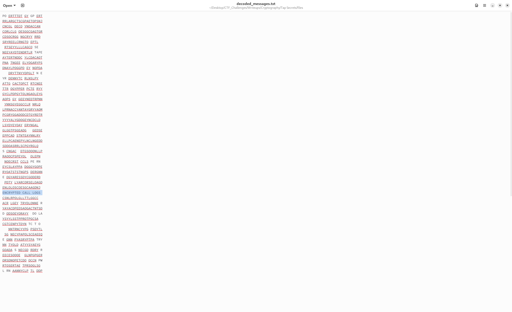

# Tap Secrets

**Author: Suraj S**     
**Points: 300**  
**Difficulty: Hard**

**Description:**

You’ve been provided with filtered call logs from the CEO, which contain suspicious long numbers suggesting covert communications. These entries may unveil a hidden conspiracy within WindShine Pvt. Ltd.

#### [suspicious_call_log.csv](suspicious_call_log.csv)

## Solution

The logs included fields such as Date, Time, Call Type, Status, Duration, and the critical "Number Dialed" field. This field contained sequences like `222 666 777 555 222 555 4 0 666 33 7777 4 4 222 4 2 4 8 4 777`, resembling old mobile multi-tap SMS encoding.


Each digit (2–9) correspond to letters, much like a phone keypad. For instance, `2` represents "ABC," `3` for "DEF," and so on. Spaces (`0`) in the sequence indicated gaps between words.


Use the following Python script to decode the sequences:

[decrypt.py](decrypt.py)

```python
import csv

char_mapping = {
    '2': 'A', '22': 'B', '222': 'C',
    '3': 'D', '33': 'E', '333': 'F',
    '4': 'G', '44': 'H', '444': 'I',
    '5': 'J', '55': 'K', '555': 'L',
    '6': 'M', '66': 'N', '666': 'O',
    '7': 'P', '77': 'Q', '777': 'R', '7777': 'S',
    '8': 'T', '88': 'U', '888': 'V',
    '9': 'W', '99': 'X', '999': 'Y', '9999': 'Z',
    '0': ' '
}

def decode_message(encoded_message):
    encoded_numbers = encoded_message.split()
    decoded_message = ''.join(char_mapping.get(num, '') for num in encoded_numbers)
    return decoded_message

csv_file_path = 'suspicious_call_log.csv'
output_file_path = 'decoded_messages.txt'

with open(csv_file_path, mode='r') as file:
    reader = csv.DictReader(file)
    with open(output_file_path, mode='w') as output_file:
        for row in reader:
            encoded_numbers = row['Number Dialed']
            decoded_message = decode_message(encoded_numbers)
            output_file.write(decoded_message + '\n')
```

    
After running the script, check the decoded_messages.txt file for decoded messages. Look through the messages to find the flag hidden among them.




### **Flag: `cyberarc{encrypted_call_logs}`**