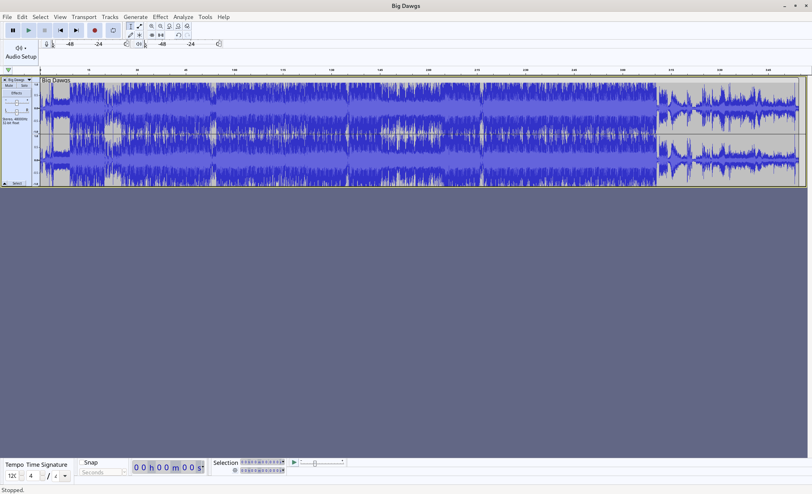
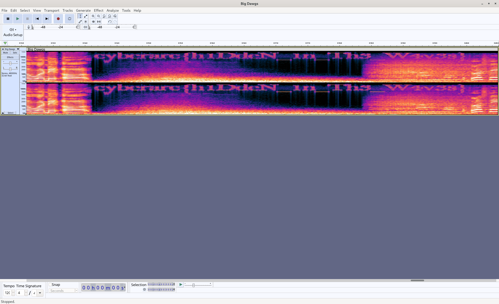

# Big Dawgs

**Author: Suraj S**  
**Points: 200**  
**Difficulty: Medium**  

**Description:**  

WindShine Pvt Ltd.'s CEO has been suspiciously blasting the trending song "Big Dawgs" on repeat during meetings. Rumor has it, the song isn't just for hype. Can you uncover the real reason behind this musical obsession?

#### [Big Dawgs.mp3](https://drive.google.com/file/d/198jgEREwWkzI-555Bhz64riYUyxPbVjo/view?usp=drive_link)

## Solution

Start by listening to the song "Big Dawgs." Pay special attention to the area around **3:14**. If you listen carefully, you will hear some distinct beep sounds that may hint at hidden information.  

Using Audacity will allow you to visually analyze the audio file and potentially reveal hidden messages that may not be easily discernible by ear.

If you don’t have Audacity installed, download it from the official site: [Audacity Download](https://www.audacityteam.org/download/).  

Audacity is a free, open-source, cross-platform audio software that allows users to record, edit, and analyze audio files. With its powerful features, you can visualize sound waves and conduct detailed analysis, making it a valuable tool for uncovering hidden information in audio tracks. After installation :

1. Open Audacity.
2. Click on **File** in the top menu.
3. Select **Open...** from the dropdown.
4. Browse to the location where you saved the "Big Dawgs" audio file and select it.
5. Click **Open** to load the audio file into Audacity.
6. In the track view (where the waveform is displayed), click the downward-facing arrow next to the track name.
7. From the dropdown menu, select **Spectrogram**.
8. You can adjust the settings for the spectrogram view by selecting **Spectrogram Settings...** from the same dropdown. This allows you to change parameters like the window size or range(not needed for this challenge).

After changing to spectrogram view, navigate to the area around **3:14** in the song. 

Listen carefully as you observe the spectrogram; you might notice that the flag is visually represented within the wave patterns.

### **Flag: `cyberarc{h1DdeN_1n_Th3_W4v3s}`**