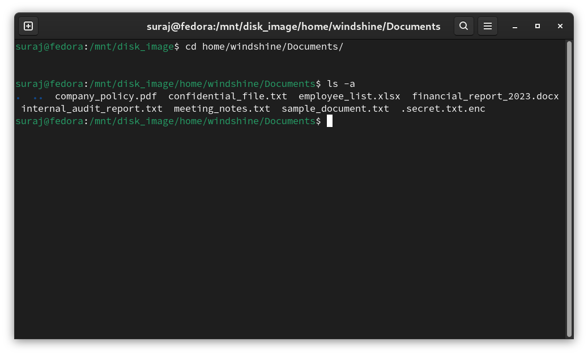
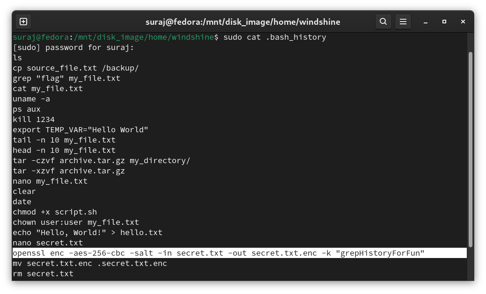
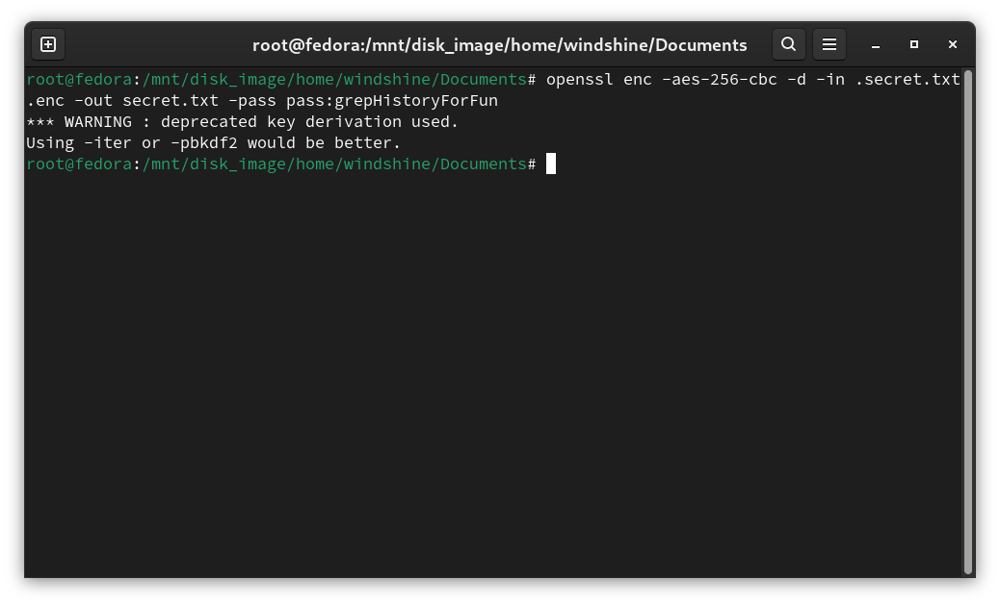
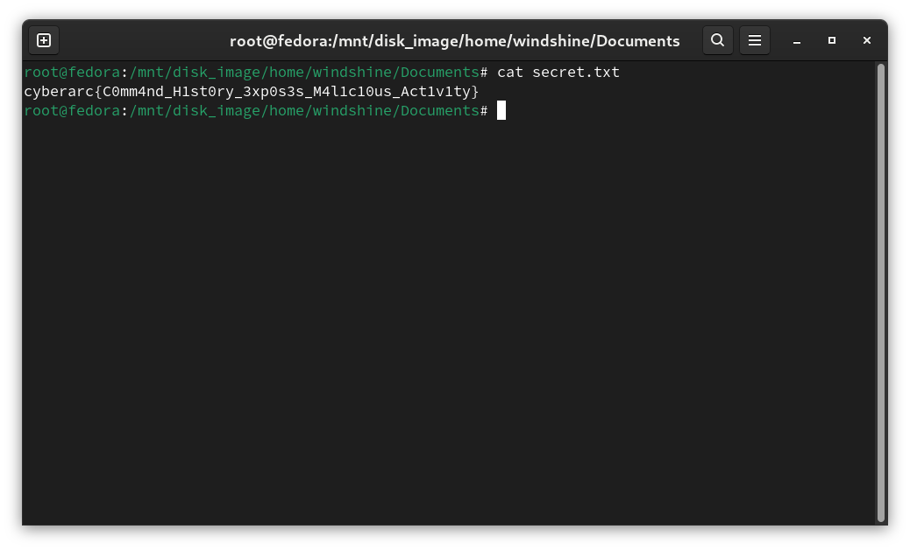

# Lost in Time

**Author: Suraj S**  
**Points: 200**  
**Difficulty: Medium**  

## Description:

During an investigation into potential misconduct at WindShine Pvt Ltd, an employee stumbles upon a mysterious disk image, rumored to hold important secrets, but the password to unlock it remains unknown.

#### [disk_image.img](https://drive.google.com/file/d/1L7pCpyvx_Yks8byzovYajpzgxaJyAJUa/view?usp=drive_link)

## Solution


We've been provided with a `.img` file, which is a disk image.

To access the contents of the provided `.img` file, we need to mount it.
Follow these steps for mounting:

1. **Open Terminal** on your system.
2. Create a mount point (a directory where the image will be accessible):
```bash
sudo mkdir /mnt/disk_image
```
3. Mount the disk image using the following command (replace image.img with the actual name of your image file):
```bash
sudo mount -o loop image.img /mnt/disk_image
```

4. Now, we can navigate to the mounted directory:
```bash
cd /mnt/disk_image
```

After mounting the image, we will see a Linux-like environment resembling a directory structure similar to a typical Linux filesystem. We can see directories like **/home**, **/root**, and **/usr**. The **/home** directory is commonly where user files are stored, providing a personal space for each user to manage their documents, downloads, and configurations.


As we search through the directories, we may need to list all files, including those that may not be immediately visible. To view all files in the current directory, including those that may be hidden, use the following command:

```bash
ls -a
```


Navigate through the directories to gather information. Start by examining the /home/windshine directory:

```bash
cd home/windshine
```

As you explore the Documents directory, you will find a suspicious file named .secret.txt.enc




Upon locating the .secret.txt.enc file, we can see that it is encrypted, indicated by the .enc extension. This suggests that the file requires a password to access its contents.

Usually, the bash_history file records the commands previously executed by the user. We can check this file to find any commands that might help us in our investigation, especially those related to file encryption. Use the following command:

```bash
cat .bash_history
```
in the home directory(/home/windshine) of the image (not your bash_history file)

Look for commands that suggest any recent file operations or encryption activities. This may help to discover useful information, including the password used for encrypting the secret file.



We can see a command in the bash_history file like: 
`openssl enc -aes-256-cbc -salt -in secret.txt -out secret.txt.enc -k "grepHistoryForFun" `

This command indicates that the file was encrypted using the AES-256-CBC algorithm, a widely used symmetric encryption standard. The -salt option helps to protect against dictionary attacks, while -k specifies the password used for encryption. So the password used here is `grepHistoryForFun`

Once we've identified the password from the bash_history, we can use it to decrypt the file. Use the following command to decrypt the file:

```bash
openssl enc -aes-256-cbc -d -in .secret.txt.enc -out secret.txt -pass pass:grepHistoryForFun
```



After running the decryption command, we will find the decrypted file in the same directory. We can view its contents using:

```bash
cat secret.txt
```

which gives us the flag



### **Flag: `cyberarc{C0mm4nd_H1st0ry_3xp0s3s_M4l1c10us_Act1v1ty}`**