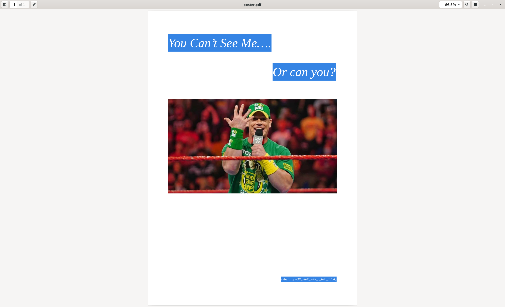

# The Cena Cover-Up

**Author: Suraj S**  
**Points: 100**  
**Difficulty: Easy**

**Description:**  

The CEO of WindShine Pvt Ltd is a huge fan of John Cena and has posters of him throughout his office. Investigators found a suspicious PDF where he mentions plans to print more Cena posters, raising red flags. Can you help uncover more about his intentions?

#### [poster.pdf](poster.pdf)

## Solution

    
We are provided with a PDF file that appears to contain plans related to the printing of John Cena posters. Upon initial inspection, the document looks ordinary, with no visible flags or hints.

The flag is cleverly hidden in the PDF, formatted in white text that matches the background color. To uncover the hidden flag, we can simply select all the text in the PDF.

By pressing **Ctrl+A** (or Command+A on macOS), we can select all the content in the document. This will highlight the white text along with the visible content, allowing us to see the hidden flag.

### **Flag: `cyberarc{w3ll_7h4t_w4s_a_b4d_1d34}` **