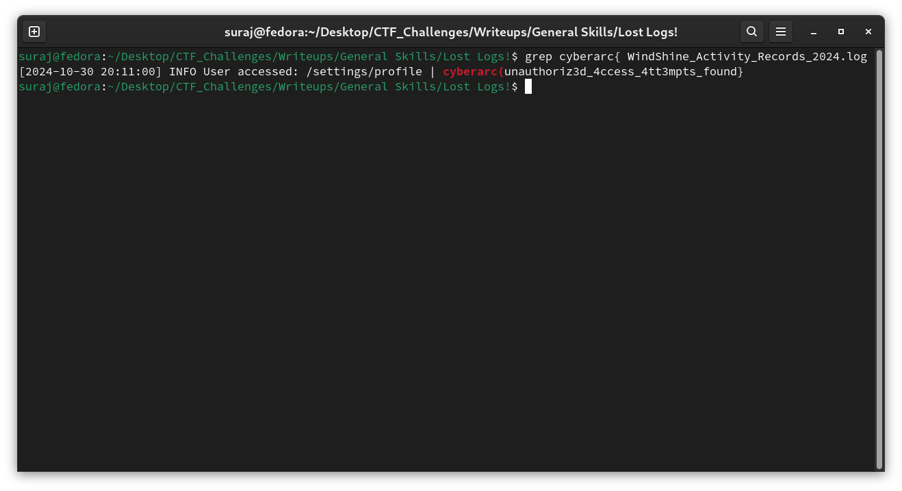

# Lost Logs!

**Author: Suraj S**  
**Points: 50**  
**Difficulty: Easy**  

**Description:**  

You discover a log file hidden in a shared folder. Check its contents to see if it contains useful information


#### [WindShine_Activity_Records_2024.log](WindShine_Activity_Records_2024.log)


## Solution

The log file contains entries in a consistent format with timestamps, log levels, user actions, and IP addresses. Within this file, the flag may be hidden somewhere in the logs.

Instead of searching line by line, we’ll use the grep command to search for the pattern cyberarc{, which matches the start of the flag format. This command will help us quickly locate the relevant line containing the flag.


```bash
grep cyberarc{ WindShine_Activity_Records_2024.log
```



### **Flag: `cyberarc{unauthoriz3d_4ccess_4tt3mpts_found}`**