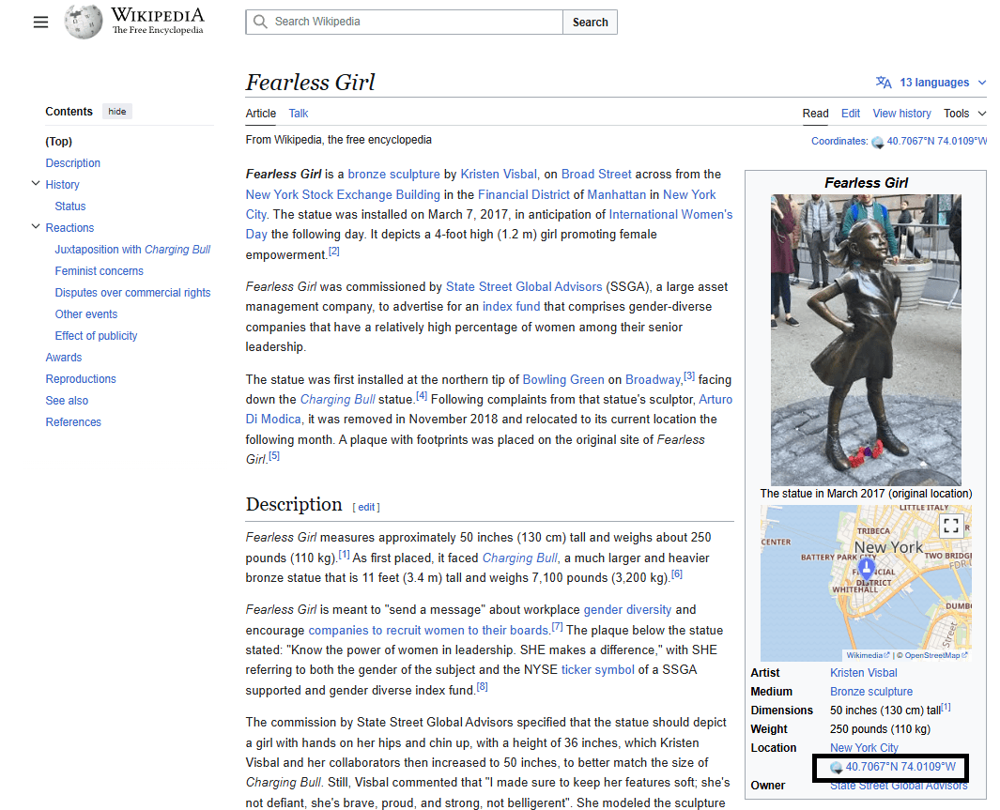
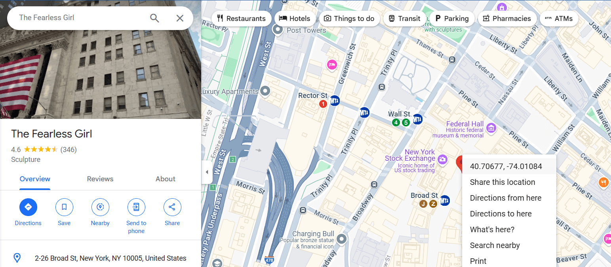

# Location Please...

**Author: Laavanya Rajan (Laav10)**  
**Category: OSINT**  
**Points: 100**  
**Difficulty: Easy**  

## Description

Tiffany has been called for a meeting at a location. She is currently at 9.755212916799914, 76.65005224796921 (09.75_76.65), just like you:) Help her locate.
Flag format: cyberarc{09.75_76.65}
Note: Keep +/- in mind!

## Solution

The challenge is about finding a location! A simple search on the current position given tell us that it is the IIIT Kottayam coordinates. Let us download tiffany.png. When you encounter an image in an OSINT challenge, always start by doing a reverse image search. Uploading it to Google Images brings up some interesting results. Let's see what we find...

Voila! its the fearless girl statue. The challenge provides an example coordinate format, with a precision of two decimal places So, the flag must be the coordinates of the Fearless girl!

A simple google search will lead you to this wikipedia page with the coordinates on it! 
Note that the West corresponds to negative when written in +/- format as the challenge demands. 

An alternative is also to look up on Google Maps. 

Now that you have got the coordinate, we have our flag!
#### Flag: `cyberarc{40.70_-74.01}`
