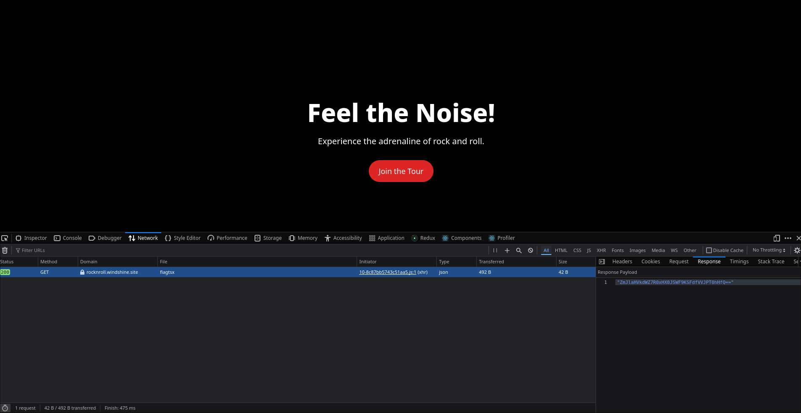
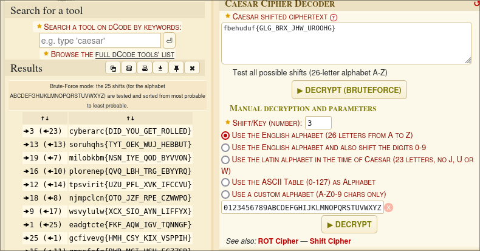

# Rock N Roll

**Author:** Vijay Venkat J  
**Points:** 100  
**Difficulty:** Easy  

## Description

During a recent concert, the CEO of WindShine left behind a mysterious note that has piqued the curiosity of fans. The note, found near the stage, is encrypted in an unusual format, hinting at secrets yet to be uncovered.

Can you decipher the message and reveal what the CEO intended to hide?

## Website Link
[rocknroll.windshine.site](http://rocknroll.windshine.site)

## Solution

We’re given a link to the WindShine concert site and a hint that the network traffic may contain a hidden flag after interacting with the site.

### Steps

1. **Explore the Site**  
    Open the developer tools (F12 or Ctrl+Shift+I) and click on the Network tab to monitor requests. Click the "Join" button on the site.  
    

2. **Capture the Flag in Network Tab**  
    Watch for a new request in the network tab after clicking "Join." The response contains an encoded string.  
    

3. **Decode the Flag**  
    The string is encoded in Base64. Copy and decode it using a Base64 decoder to reveal the hidden message.  
    

### Final Flag

The decoded string reveals the flag:

`Cyberarc{DID_YOU_GET_ROLLED}`
